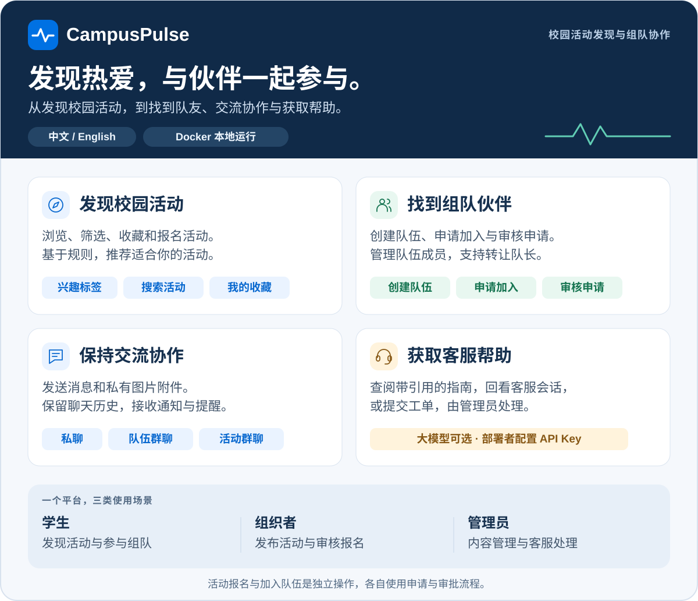

# CampusPulse 校园活动智能推荐与组队平台

[English](README.md) · [运行与运维](docs/operations.zh-CN.md) · [架构](docs/architecture.md) · [接口](docs/api.md) · [项目审阅指南](docs/portfolio-overview.md)

CampusPulse 源于高校合作课程项目，围绕校园活动发现、报名与组队协作实现了一套可运行的系统。本仓库提供双语界面、Java API、MySQL 数据库以及可选的离线推荐训练程序，供代码审阅和本地体验；文档以现有实现为准。



## 已实现能力

- 活动浏览、筛选、搜索、收藏、报名及审批状态跟踪。
- 活动发布、编辑、报名审核、参与者群聊与活动提醒。
- 队伍创建、入队申请、申请审批、成员管理、队长转让和关闭。
- 私聊、队伍群聊、活动群聊、私有图片附件、消息历史和已读游标。
- 个人资料与兴趣标签；邮箱验证注册、账号恢复与账号信息变更。
- 通知、客服知识回答、工单提交以及管理员回复。
- 用户与角色管理、活动审核、标签、精选内容和操作审计。
- 基于兴趣、热度、时间和名额的规则推荐，可组合离线历史转化模型分数。

界面支持 English / 简体中文切换，40 条演示活动与 33 条队伍的标题、介绍、地点、标准标签和生成封面均提供英文展示，英文标题和标签也可以搜索。用户自己填写的内容和上传图片像素保留原文；修改演示文字后旧译文会失效。

智能客服已改为本地 **LangGraph** 服务：15 条双语指南、来源引用、持久化多轮会话和显式转人工工单。无需模型密钥即可检索回答；默认关闭模型生成。若要启用，下载并部署项目的人需要提供自己的接口地址、模型名称和 API Key，见[下方配置步骤](#启用模型生成客服可选)。网站普通用户无需填写密钥。真实外部模型与 SMTP 尚未完成联调，配置见[中文客服说明](support-agent/README.zh-CN.md)。

## 下载运行

在 GitHub 点击 **Code → Download ZIP**，解压后在项目根目录（包含 `docker-compose.yml` 的目录）打开终端。也可以使用 Git 克隆：

```bash
git clone https://github.com/xkkkkkkm/campuspulse.git
cd campuspulse
```

本 README 中的命令均从项目根目录执行。Windows 若没有 `python3` 命令，请替换为 `py -3.11`，或你已安装的 Python 3.11+ 命令。

安装 **Docker（含 Compose v2）**（macOS/Windows 可用 Docker Desktop）与 **Python 3.11+**，然后启动 Docker。此方式下 Java、Maven、Node.js、MySQL 和客服所用 Python 3.13 都在容器中运行，无需在电脑上另行安装。首次下载镜像和依赖需要联网。先检查环境：

```bash
python3 --version
docker compose version
docker info
```

再初始化并启动演示：

```bash
python3 tools/dev.py init
python3 tools/dev.py up
```

访问 [http://127.0.0.1:8125](http://127.0.0.1:8125)。首次构建会下载依赖，可能持续数分钟；终端中的 Docker 构建日志是正常过程。脚本生成带随机应用密钥的本地 `.env`，随后构建并等待 MySQL、后端、前端和私有 LangGraph 客服这四个服务就绪。客服检索回答无需模型密钥。默认宿主机端口只绑定回环地址：前端 `8125`、后端 `8080`、数据库 `3306`；客服服务不映射宿主机端口。

| 角色 | 用户名 | 密码 |
| --- | --- | --- |
| 学生 | `linzhixia` | `demo12345` |
| 组织者 | `org` | `org123` |
| 管理员 | `admin` | `admin123` |

这些账号是公开的本地演示数据。默认 `demo` profile 只为每个数据库初始化一次；重启保留用户修改，也不会自动延后示例活动日期。体验注册时，点击“发送验证码”，演示模式会在页面提示或弹窗中显示验证码，不会真正发送邮件；也可以直接使用上表账号，无需注册。真实用户部署必须使用新数据库并按[生产配置说明](docs/operations.zh-CN.md#生产配置)设置。

停止服务并保留数据卷：

```bash
python3 tools/dev.py down
```

再次运行 `python3 tools/dev.py up` 即可恢复服务。端口冲突、原生 Java 开发、备份恢复及排障见[运行与运维](docs/operations.zh-CN.md)。

## 首次启动后怎么检查

```bash
docker compose ps
python3 tools/smoke_test.py --base-url http://127.0.0.1:8125
```

应看到 `mysql`、`backend`、`frontend`、`support-agent` 四个服务健康，冒烟检查输出报告且不报错。脚本使用演示账号，不适用于正式数据库，也不验证 SMTP 或模型生成。如果修改了 `FRONTEND_PORT`，浏览器地址和 `--base-url` 中的 `8125` 都需要替换。

先用学生账号浏览活动、申请加入队伍，并向客服提问“如何申请加入队伍？”。用组织者账号审核活动报名，用管理员账号处理审核和客服工单。加入队伍与报名其关联活动是两个独立操作；待审核申请需要负责人批准。

| 功能 | 默认启动后可用吗？ | 额外配置 |
| --- | --- | --- |
| 活动、组队、聊天、通知、人工工单 | 可以 | 使用上方演示账号 |
| 带引用的双语客服指南 | 可以 | 无需模型密钥；使用小型本地短语/关键词检索 |
| 大模型生成客服回答 | 默认关闭 | 自行配置接口地址、模型和 API Key，步骤见下方 |
| 真实邮箱验证码 | 默认不发邮件，在页面显示验证码 | [配置 SMTP](docs/operations.zh-CN.md#生产配置) |
| 推荐排序 | 可以，默认使用规则 | [离线模型训练](ml/README.zh-CN.md)需要足够真实观察数据，合成演示数据不用于训练 |

## 启用模型生成客服（可选）

**模型由部署 CampusPulse 的人统一配置；访问网站的普通用户不需要提供 API Key。** LangGraph 负责组织客服处理流程，本身不提供模型账号、API Key 或免费调用额度。未完成下述配置时，客服返回经过整理的本地指南，不是大模型生成的回答。

1. 在你选择的模型服务商控制台申请 API Key，并查明准确的模型标识和兼容 OpenAI 协议的 **Base URL**（基础地址，不是完整的 `/chat/completions` 路径）。所选模型/API 必须支持 Chat Completions 以及 `response_format: {"type":"json_object"}`。模型是否可用、调用费用取决于服务商。
2. 执行过 `python3 tools/dev.py init` 后，用文本编辑器打开**项目根目录生成的 `.env`**。修改 `.env` 中已有的以下配置，并保留其他设置。下面是文件内容，不是终端命令；`.env.example` 仅为模板。将三项示例值替换为服务商提供的实际值：

```dotenv
SUPPORT_AGENT_ENABLED=true
SUPPORT_LLM_ENABLED=true
SUPPORT_LLM_BASE_URL='https://api.your-provider.example/v1'
SUPPORT_LLM_MODEL='your-provider-model-id'
SUPPORT_LLM_API_KEY='your-provider-api-key'
```

上面的 `.example` 地址、模型名和密钥都是占位示例，不能原样使用。保留初始化生成的 `SUPPORT_AGENT_TOKEN`：它是服务间共享密钥，与模型 API Key 不同。`.env` 已被 Git 忽略，不应提交或粘贴到 issue。只有 Python 客服容器接收模型密钥，浏览器不会获取它。开启生成会将问题及受限近期历史发送给服务商，并尽力脱敏，详见[数据处理与限制](support-agent/README.zh-CN.md#可选模型与隐私边界)。

3. 应用配置，同时更新后端和客服容器：

```bash
docker compose up -d --wait backend support-agent
```

`up` 会用新环境变量重新创建需要更新的容器；`docker compose restart` 不会重新读取 `.env`。若使用独立配置/项目，例如 `.env.prod` 和 `campuspulse-prod`，执行 `docker compose --env-file .env.prod -p campuspulse-prod up -d --wait backend support-agent`。不用 Docker 的开发者请按[客服原生启动说明](support-agent/README.zh-CN.md#本地运行)操作。

4. **先登录项目账号**，打开客服，新建会话后提问“如何申请加入队伍？”。匿名访客始终使用检索。即使启用了模型，也需要命中相关指南且额度未用完；默认每用户每小时最多预留 10 次生成额度，全站每天 100 次（`SUPPORT_MAX_DAILY_GENERATIONS`）。
5. 查看**新回答**下方的来源标签：“智能客服”表示模型结果通过校验，“帮助文档”表示检索或回退。要准确判断，可打开浏览器开发者工具 → **Network / 网络**，选择 `POST /api/support/chat` 的响应，查看 `data.source`：

| `data.source` | 含义 |
| --- | --- |
| `LANGGRAPH_LLM` | 模型返回结果且通过应用校验 |
| `LANGGRAPH_RETRIEVAL` | LangGraph 本地指南；未调用模型或已回退 |
| `LOCAL_KNOWLEDGE` | Java 应急指南；图服务被关闭、不可用或繁忙 |

HTTP 成功或容器健康不等于模型调用成功。若仍收到指南，依次检查登录状态、四个 `SUPPORT_LLM_*` 配置、服务商/模型接口格式、额度及[回退排查说明](support-agent/README.zh-CN.md)。默认模型超时为 8 秒；超时或回答未通过校验都会回退。未知问题只建议提交工单，不会自动创建工单。

关闭外部模型调用时，将 `SUPPORT_LLM_ENABLED=false`，再执行同一条 `docker compose up` 命令即可；本地指南和工单继续可用。仓库已实现模型适配器并通过模拟提供商测试，但尚未验证真实外部服务商调用。

## 常见启动问题

| 现象 | 处理方法 |
| --- | --- |
| 找不到 `docker` / `python3` 命令 | 安装上方依赖；Windows 可用 `py -3.11` 或已安装的 Python 3.11+ 命令 |
| 无法连接 Docker daemon | 启动 Docker Desktop/Docker 服务，再试 `docker info` |
| 正在下载镜像层、Maven/Python 包 | 等待首次构建完成；下载报错时检查网络/代理后重新执行 `python3 tools/dev.py up` |
| 端口被占用 | 修改 `.env` 中对应的 `FRONTEND_PORT`、`BACKEND_PORT`、`MYSQL_PORT`；更改前端端口还要更新浏览器来源，见[端口示例](docs/operations.zh-CN.md#本地容器演示) |
| 页面能打开，但接口报错 | 查看 `docker compose ps` 和 `docker compose logs --tail=100 backend`；直接双击 HTML 不会启动 API |
| 改了 `.env` 但没有生效 | 用 `docker compose up -d --wait` 重新创建受影响容器；终端已导出的同名环境变量优先于 `.env` |
| 收不到验证码邮件 | 默认演示模式在页面显示验证码，真实发信需配置 SMTP |
| 英文模式还有部分中文 | 内置演示内容有译文；用户填写的文字、姓名和上传图片中的文字保留原样 |
| 旧演示活动日期已过去 | 数据只初始化一次；发布新活动或使用独立演示数据库，重启不会刷新日期 |

容器外开发所需工具和服务启动顺序见[原生开发](docs/operations.zh-CN.md#原生开发)。

## 工程结构

| 目录 | 内容 |
| --- | --- |
| `frontend/` | 原生 HTML、CSS 与模块化浏览器 JavaScript；双语界面 |
| `backend/` | Java 17、Spring Boot、JDBC、Flyway 与 MySQL |
| `support-agent/` | FastAPI / LangGraph，双语指南检索和可选模型生成 |
| `ml/` | 时序 GradientBoostingClassifier 训练、评估、版本发布 |
| `docs/` | 当前架构、接口、运维说明及历史课程源材料 |
| `tools/` | 安全环境加载、本地代理、冒烟检查、备份工具 |

系统采用模块化单体：Node 服务提供静态页面并代理 API；单个 Spring Boot 实例处理业务，私有 LangGraph 服务处理客服检索和生成；MySQL 保存业务数据与推荐分数，持久化目录保存图片。SSE、短期连接票据和请求限流计数保存在进程内，当前部署边界是单 API 实例。HTTPS 终止和多实例共享基础设施需在部署环境另行配置。

推荐训练使用真实曝光和服务端记录的转化，以时间划分训练集与验证集并隔离标签窗口；排除旧版与合成演示行为。数据不足时输出 `insufficient-data`，不发布模型，在线继续规则推荐。详见[中文模型说明](ml/README.zh-CN.md)。仓库不宣称生产准确率或因果提升。

## 验证与审阅

```bash
# Java 17、Maven 3.9+，集成测试还需要运行中的 Docker
python3 tools/dev.py test

# Node.js 22+
npm --prefix frontend ci
npm --prefix frontend run check
npm --prefix frontend test
node --test tools/tests/proxy.test.cjs

python3 -m unittest discover -s tools/tests

# 需先启动演示服务；检查登录、浏览及管理员访问限制
python3 tools/dev.py run python3 tools/smoke_test.py
```

会写入测试数据的图片、模型发布和恢复检查见[隔离测试环境](docs/operations.zh-CN.md#隔离集成演练)。浏览器测试见[前端说明](frontend/README.md)，模型测试见[模型说明](ml/README.zh-CN.md)。这些命令用于复现验证，不代表所有环境均已通过；当前完成情况和限制见[整改状态与验证记录](docs/remediation-status.zh-CN.md)。历史课程评估、设计和管理材料仅保留为过程背景，不作为当前实现证据。

项目代码采用 [MIT License](LICENSE)，第三方资源遵循[各自许可证](THIRD_PARTY_NOTICES.md)。仓库不将合作成果全部归于个人，也不暗示学校背书。个人贡献应以提交记录和可审阅改动为依据。课程旧二进制、真实密钥、用户上传及生成文件不进入源码发布。
