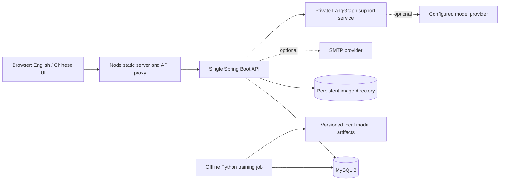

# Architecture

[Documentation index](README.md) · [运行说明（中文）](operations.zh-CN.md)

## Runtime topology

Docker Compose builds the frontend, backend and support agent from source and starts MySQL. The agent has no published host port. Host ports bind to `127.0.0.1` by default. The Node service serves only top-level HTML and permitted `assets/` files, proxies `/api/` and `/uploads/`, and exposes `/healthz`. The Spring application is a modular monolith, with SQL-backed business services; the support graph is a separate private component with no database or application-action tools. It uses Java 17, Spring MVC, JDBC and Flyway; there is no ORM or queue dependency.

The static frontend uses browser JavaScript modules. Runtime assets, including Font Awesome, are local. npm dependencies support source checks and browser tests; they are not needed to serve the built-in pages. English/Chinese selection includes reviewed demo content and platform vocabulary. API source fields remain unchanged, while `translations.en` carries valid display translations. User text and uploaded image pixels are preserved.

## Module boundaries

| Module | Responsibility |
| --- | --- |
| `auth`, `security`, `config` | Email codes, accounts, password hashes, tokens, access policy, CORS, limits, production checks |
| `activity`, `team` | Discovery, lifecycle, applications, approvals, capacity, membership and ownership |
| `message`, `realtime` | Persisted chat, retry IDs, history cursors, private media, read states and SSE hints |
| `profile`, `user`, `tag`, `search` | Personal records, protected user lookup, tags and SQL keyword search |
| `recommend`, `behavior`, `event` | Rule/model score composition, client observations and server conversions |
| `notification`, `maintenance` | Personal notices, scheduled reminders and bounded retention cleanup |
| `support`, `admin` | Support conversations/quotas, explicit tickets, governance and audit records |
| `content` | Provenance-bound demo translations and English keyword/tag search |
| `support-agent/` (Python) | LangGraph routing, 15 bilingual guides, optional contextual generation and citation validation |
| `common`, `upload`, `bootstrap` | API errors, validated image files, one-time demo and first-admin initialization |

Activity and team paths separate controllers, services and repositories. Some other feature controllers still contain SQL. This is a pragmatic course-project structure rather than a claim of complete clean architecture.

## Request and consistency model

1. Browser API requests attach a bearer token and the selected language. The interceptor uses an explicit public-route allowlist; additional API routes require authentication by default.
2. Signed access tokens expire and carry a token version. Validation also reads the current account status, role and token version from MySQL. Logout, password/security changes and selected administration operations can invalidate existing tokens.
3. Feature code checks ownership or participation before returning protected records or performing writes. A common response includes `success`, `message`, `data` and `code`; HTTP status conveys the error category.
4. Capacity decisions lock the activity/team row before changing registration or membership. Database uniqueness and version checks handle duplicate and stale writes. Administrator mutations serialize the last-active-administrator invariant.
5. Mutations persist records before emitting realtime hints. Message retries with the same client ID reuse the original message if the content and conversation match; conflicting reuse returns a conflict. Direct-message sends lock the canonical user pair so committed IDs can support forward history recovery.

Passwords use the custom PBKDF2 implementation in `security/PasswordHasher.java`, not plaintext storage. The signed token implementation is project code, not an external identity provider. See the code and tests for exact behavior; these mechanisms do not imply a completed external security audit.

## Chat and files

`POST /api/realtime/chat/ticket` exchanges a bearer token for a one-use ticket with a 60-second lifetime. `GET /api/realtime/chat/stream` consumes it and validates one requested scope: team, activity or direct-message peer. The browser's EventSource URL contains the short-lived ticket rather than the access token. The client reads persisted history using message IDs when reconnecting; SSE is not a durable message queue.

Images are decoded, bounded and re-encoded before storage. Avatar and cover paths are public presentation assets. Chat images use `/api/chat-media/{id}`, bearer authentication, no-store responses and access checks for the uploader, a direct-message participant or an authorized group participant. The chat directory is not publicly mapped. The API tracks upload ownership in MySQL and rejects deletion of referenced images. It has no S3/object-storage adapter.

## Persistence and migration

The authoritative schema lives in Flyway migrations. V1 is the baseline; V2 is a Java legacy upgrade; V3 adds security, upload and ticket records; V4 adds business consistency, history and governance records; V5 adds trusted telemetry provenance and immutable recommendation releases; V6 adds private chat media, group read cursors and direct-message coordination; V7 binds reviewed demo translations without overwriting source content; V8 adds owned support conversations, ordered turns and provider-neutral usage counters; V9 updates unchanged support-demo descriptions for the LangGraph implementation.

On a new demo database, a transaction locks the initialization record and seeds fixtures once. Starting again does not reinstall them. Production initialization creates the first administrator when none is active. Existing demo data is not removed by selecting `prod`, so production begins with a separate database.

The backup helper pauses the API writer and captures a database dump plus uploaded files. Restores use an unused Compose project and separate volumes. See [operations](operations.md#backup-and-restore) for the required controls and what a backup excludes.

## Recommendations and integration boundaries

The online path filters current eligible items, caps candidate selection, computes rule scores and optionally combines scores from the active, unexpired offline release. Rules use interests, popularity, timing, featured weights and team availability. Search is SQL keyword matching; there is no semantic vector search. The historical `item_embedding` table is not an implemented semantic retrieval service.

The Python job trains a GradientBoostingClassifier on past exposure and trusted conversion counts. A chronological holdout and purged conversion window reduce temporal leakage. Release scores and the serving pointer change in one database transaction after immutable artifacts have been written. Releases expire after seven days; missing or expired scores fall back to rules. [Model documentation](../ml/README.md) explains data requirements and evaluation limitations.

The private support service uses a real LangGraph StateGraph: route, retrieve, optionally generate, validate and answer. It supports 15 reviewed bilingual guides, bounded recent history and source citations. Java owns user authentication, conversation ownership, 45-second turn leases, per-user limits, atomic daily generation budgets and explicit ticket creation. It never holds a database transaction across a model call. Anonymous requests use retrieval only; graph failure falls back to a small Java guide. Model-generated text is untrusted, and structural/citation checks cannot prove all statements correct. See the [agent guide](../support-agent/README.md). Production email needs SMTP; live external model/SMTP delivery remains unverified.

## Deployment limits

The supplied deployment is one API instance. SSE emitters, one-use tickets and general rate limits are process-local; multiple replicas need shared coordination and event delivery. A shared upload volume alone does not make the application horizontally scalable.

Request limits use the socket peer address. Behind the bundled proxy, many users share one address and therefore share its IP limit. Forwarded headers are not used as a trusted client-IP identity. A real deployment needs an explicit trusted-proxy and perimeter rate-limit design, HTTPS termination, log collection, monitoring, backup scheduling and restore exercises. The repository has database-aware readiness, separate liveness, private Actuator metrics and ECS structured console logging, but does not ship a complete observability platform, high-availability database or measured service-level objective.
