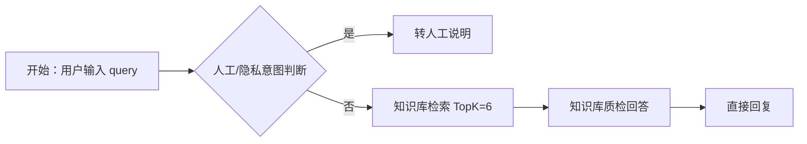

# Dify 智能客服 Chatflow 搭建说明

本项目已提供参考 DSL：

- `docs/dify/campuspulse-customer-service.yml`

Dify `1.14.1` 对 DSL 导入 schema 和 `直接回复` 节点变量绑定比较敏感。如果导入时报版本差异，或者预览里原样输出 `{{#xxx#}}`，不要继续反复导入这个手写文件，改按下面文件手工搭建：

- `docs/dify/dify-1.14.1-manual-build.md`

如果需要 100% 可导入的完整 DSL，先在你当前 Dify 1.14.1 的应用里导出一个空白/基础 DSL，再基于这个导出文件修改。这样才能保证字段 schema 与版本一致。

导入参考 DSL 后需要你在 Dify 里手动确认三件事：

1. LLM 节点模型选择你已配置的 `DeepSeek`。
2. 知识检索节点绑定你已创建的 `CampusPulse 使用帮助知识库`。
3. 最后的 `直接回复` 节点必须用变量选择器绑定最终 LLM 的输出文本，不要手写 `{{#xxx#}}`。

## 推荐 Chatflow 结构



## 系统提示词

```text
你是 CampusPulse 校园活动与组队平台的智能客服。
你只回答平台使用相关问题，包括账号、邮箱验证码、活动、报名、组队、消息、通知、个人中心、后台管理、推荐与搜索。
你必须优先依据知识库内容回答，不要编造平台不存在的功能。
回答要简洁、明确、可操作。
如果用户要求人工、真人、管理员、老师协助，或者问题涉及具体账号数据、隐私、审批结果、数据库状态、支付和密钥，不要继续猜测，直接说明可以转人工处理。
如果知识库为空、知识库内容和问题不匹配，必须建议转人工，不要编造。
```

## 多轮记忆

在 Dify LLM 节点开启 `记忆`，窗口建议设置为 `10`。本项目后端也会保存并回传 Dify 的 `conversation_id`，所以同一个客服页面内可以连续多轮追问。

## 知识库不匹配时的处理

新版 DSL 把“质检”和“最终回答”合并在同一个 LLM 节点里，避免跨节点变量引用导致 `{{#xxx#}}` 原样输出。

- 知识库检索为空，回复转人工说明
- 检索内容和用户问题不匹配，回复转人工说明
- 涉及具体账号、隐私、审批结果、数据库状态、密钥或支付，回复转人工说明
- 只有知识库能明确支撑答案时，才输出具体操作步骤

## 转人工说明

Dify 只能在对话中输出“建议转人工”。项目内真正的转人工闭环由后端 `/api/support/escalate` 完成：前端“转人工服务”按钮会通知管理员，管理员会在通知中心看到请求。

## 导入后的测试问题

- 怎么报名活动？
- 我收不到验证码怎么办？
- 队伍满员后还能审批吗？
- 我要找人工客服
- 我的账号被锁了，帮我查一下
- 推荐活动为什么和别人不同？
