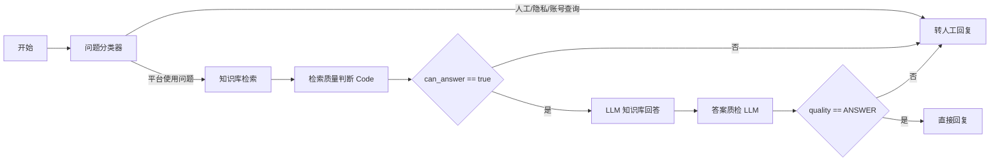

# Dify 1.14.1 智能客服完整工作流手工搭建版

当前 Dify 版本：`1.14.1`

说明：Dify 的 DSL 在不同版本之间对节点字段、变量名和 Answer 节点引用较敏感。如果导入 DSL 报版本差异，建议按本说明在 UI 中搭建。搭建完成后再导出 DSL，即可得到与你当前 Dify 版本完全兼容的文件。

## 先说明当前报错原因

你截图里出现 `{{#quality-check.text#}}` 或 `{{#llm-answer.text#}}` 原样输出，不是 DeepSeek 没回答，也不是知识库没命中。从追踪日志看，LLM 节点已经产生了真实答案，问题发生在 `直接回复 / Answer` 节点：它没有正确绑定上游节点的输出变量，而是把变量模板当成普通文本发给了用户。

Dify 1.14.1 下要避免这个问题，必须遵守两条规则：

- 不要在 `直接回复` 节点里手打 `{{#xxx#}}`。
- 必须点击回复框右上角的变量按钮 `{x}`，从变量选择器里选择上游 LLM 节点的输出文本。

如果导入 DSL 后仍然显示模板字符串，直接删除最后的 `直接回复` 节点，重新从最终 LLM 节点后面添加 `直接回复`，再用变量选择器选择 `最终回答 LLM -> text/输出文本`。

## 推荐落地方式

当前建议使用 `UI 手工搭建完整工作流`，不要继续依赖手写 DSL 导入。

原因：

- Dify DSL 导入只适合相同或非常接近的导出版本。
- 你现在的版本是 `1.14.1`，手写 YAML 里即使节点逻辑正确，也可能因为字段名、变量引用元数据、Answer 节点 schema 差异导致导入失败。
- UI 手工搭建后再导出，得到的 DSL 才是你当前 Dify 版本 100% 兼容的完整版本。

如果你一定要我给“可直接导入版”，请先在 Dify 当前这个空白应用里点击 `导出 DSL`，把导出的 `.yml` 发给我。我会基于你 Dify 1.14.1 自己导出的 schema 修改，这样才能保证导入成功。

## 完整流程



## 节点 1：开始

使用默认 `开始` 节点即可。

保留用户输入变量：

```text
sys.query
```

## 节点 2：问题分类器

节点类型：`问题分类器`

分类 1：`人工/隐私/账号查询`

分类描述：

```text
用户要求人工、真人、管理员、老师协助；或询问具体账号状态、我的报名、我的申请、审批结果、数据库状态、密码、密钥、支付、隐私数据。
```

分类 2：`平台使用问题`

分类描述：

```text
用户询问 CampusPulse 平台的使用方法，包括注册登录、邮箱验证码、活动报名、活动发布、活动管理、组队申请、队伍管理、私聊、群聊、通知中心、个人中心、后台管理、推荐和搜索。
```

连接规则：

- `人工/隐私/账号查询` -> `转人工回复`
- `平台使用问题` -> `知识库检索`

## 节点 3：知识库检索

节点类型：`知识库检索`

绑定知识库：

```text
CampusPulse 使用帮助知识库
```

查询变量：

```text
sys.query
```

建议配置：

```text
Top K: 6
检索方式: 混合检索或向量检索
相似度阈值: 0.35 - 0.45
```

## 节点 4：检索质量判断 Code

节点类型：`代码执行`

语言：`Python`

输入变量：

```text
retrieval_result = 知识库检索.result
query = sys.query
```

代码：

```python
def main(retrieval_result, query):
    if retrieval_result is None:
        return {"can_answer": False, "reason": "NO_RETRIEVAL"}

    results = retrieval_result if isinstance(retrieval_result, list) else []
    if len(results) == 0:
        return {"can_answer": False, "reason": "EMPTY_RETRIEVAL"}

    text = str(results)
    query_text = str(query or "")
    platform_keywords = [
        "注册", "登录", "邮箱", "验证码", "报名", "活动", "组队", "队伍", "审批",
        "群聊", "私聊", "通知", "推荐", "搜索", "后台", "个人中心", "管理员",
        "密码", "满员", "取消", "发布"
    ]
    hit = sum(1 for kw in platform_keywords if kw in query_text and kw in text)

    if hit <= 0 and len(text) < 80:
        return {"can_answer": False, "reason": "LOW_RELEVANCE"}

    return {"can_answer": True, "reason": "KNOWLEDGE_MATCHED"}
```

输出变量：

```text
can_answer: Boolean
reason: String
```

连接到 `IF/ELSE` 节点。

## 节点 5：IF/ELSE 检索是否可答

条件：

```text
检索质量判断.can_answer == true
```

连接规则：

- true -> `LLM 知识库回答`
- false -> `转人工回复`

## 节点 6：LLM 知识库回答

模型：你配置好的 `DeepSeek`

开启记忆：

```text
记忆窗口: 10
```

System Prompt：

```text
你是 CampusPulse 校园活动与组队平台的智能客服。
你只回答平台使用相关问题，包括账号、邮箱验证码、活动、报名、组队、消息、通知、个人中心、后台管理、推荐与搜索。
你必须优先依据知识库检索结果回答，不允许编造平台不存在的功能。
如果知识库内容不能支撑答案，或者问题涉及具体账号、隐私、审批结果、数据库状态、密钥或支付，必须回答：这个问题需要人工处理，请点击项目客服页面里的“转人工服务”按钮。
回答要简洁、明确、可操作。
不要输出 JSON、变量名或模板语法。
```

User Prompt：

```text
用户问题：
{{sys.query}}

知识库检索结果：
{{知识库检索.result}}

请直接输出最终给用户看的回答。
```

连接到 `答案质检 LLM`。

## 节点 7：答案质检 LLM

模型：DeepSeek

温度：`0`

System Prompt：

```text
你是客服答案质检器。你只能输出 ANSWER 或 ESCALATE。

输出 ANSWER 的条件：
1. 知识库检索结果与用户问题明显相关；
2. 候选答案有明确操作步骤或说明；
3. 不涉及查询具体账号、隐私、审批结果、数据库状态、密钥或支付；
4. 候选答案没有表达“不确定、可能、没有找到、建议转人工、知识库没有覆盖”等意思。

其他所有情况输出 ESCALATE。
不要输出任何解释。
```

User Prompt：

```text
用户问题：
{{sys.query}}

知识库检索结果：
{{知识库检索.result}}

候选答案：
{{LLM 知识库回答 的输出变量}}

请只输出 ANSWER 或 ESCALATE。
```

连接到 `IF/ELSE 答案是否通过`。

## 节点 8：IF/ELSE 答案是否通过

条件：

```text
答案质检 LLM 输出 contains ANSWER
```

连接规则：

- true -> `直接回复`
- false -> `转人工回复`

## 节点 9：直接回复

节点类型：`直接回复`

不要手写 `{{#xxx#}}`。

在回复框里通过 Dify 变量选择器选择：

```text
LLM 知识库回答 -> 输出文本
```

如果变量列表里同时出现 `text`、`answer`、`output`，优先选择预览中能显示完整文本的那个。按你当前追踪日志，Dify 1.14.1 的 LLM 输出字段通常是 `text`。

如果你看到 `{{#xxx#}}` 原样显示，按下面步骤修：

1. 删除当前 `直接回复` 节点。
2. 从 `LLM 知识库回答` 节点右侧的加号重新添加 `直接回复`。
3. 点击回复框的 `{x}` 变量按钮。
4. 选择 `LLM 知识库回答 -> text` 或 `LLM 知识库回答 -> 输出文本`。
5. 不要再手工输入任何 `{{#...#}}`。
6. 预览测试 `怎么报名活动？`，如果仍然输出模板，说明选择的不是 LLM 输出字段，换成同一节点下另一个文本字段。

## 节点 10：转人工回复

节点类型：`直接回复`

回复内容：

```text
这个问题需要人工处理。请点击项目客服页面里的“转人工服务”按钮，系统会把你的问题发送给管理员；你也可以继续补充账号、活动名、队伍名和问题截图等背景信息。
```

## 测试用例

应该直接回答：

- 怎么报名活动？
- 收不到邮箱验证码怎么办？
- 队伍满员后还能管理吗？
- 通知中心怎么只看未读？
- 推荐活动为什么和别人不一样？

应该转人工：

- 我要找人工客服
- 帮我查一下我的报名有没有通过
- 我的账号为什么被锁了
- 你帮我改一下密码
- 帮我看数据库里有没有我的记录
- DeepSeek API Key 怎么配置到我的账号

## 发布和接入项目

Dify 里预览通过后，执行：

1. 点击右上角 `发布`。
2. 进入 `访问 API`，复制这个应用的 API Key。
3. 在本项目后端启动环境中配置：

```bash
export DIFY_ENABLED=true
export DIFY_BASE_URL=https://api.dify.ai/v1
export DIFY_API_KEY=你的Dify应用APIKey
```

4. 重启 Spring Boot 后端。
5. 打开项目客服页测试：

```text
http://127.0.0.1:8080/customer-service.html
```

如果 Dify 仍然不可用，项目后端会自动回退到本地知识库，不会导致客服页面完全失效。

## 完整能力验收表

| 能力 | 验收方式 | 预期结果 |
| --- | --- | --- |
| 多轮记忆 | 先问“怎么报名活动”，再问“那满员怎么办” | 能理解第二问仍然指活动报名 |
| 知识库问答 | 问“通知中心怎么只看未读” | 根据知识库给出操作步骤 |
| 知识库不匹配兜底 | 问“帮我查我的报名通过了吗” | 不编造，提示转人工 |
| 隐私/账号兜底 | 问“帮我看我的账号为什么被锁” | 提示转人工 |
| 人工入口 | 问“我要转人工客服” | 直接提示点击项目里的转人工按钮 |
| 变量绑定 | 问任意问题 | 不出现 `{{#xxx#}}` |
