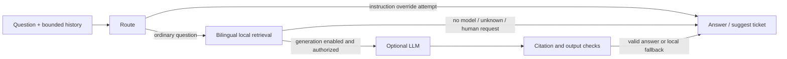

# CampusPulse support agent

[简体中文](README.zh-CN.md)

This private Python service provides bilingual support through an actual LangGraph `StateGraph`. Java owns the public API, user authentication, conversation ownership and storage, per-user quotas, and support ticket creation. This service has no database, application credentials, ticket API client, browser, or model tools.

The graph routes a question, retrieves reviewed local guides, optionally generates an answer with `langchain-openai`, checks its structure and citations, and returns an answer or a suggestion to submit a ticket. Without model configuration it uses local phrase matching against 15 bilingual guides; it cannot generate an open-ended model answer. Missing configuration, provider errors, timeouts, or invalid generated answers fall back to the local guides. A returned suggestion never creates a ticket. `LANGGRAPH_RETRIEVAL` explicitly identifies answers that did not use a valid model result.

For the recommended Compose setup, follow [Enable model-generated support (optional)](../README.md#enable-model-generated-support-optional). The **deployer** fills in the provider settings in the repository-root `.env`; website visitors do not enter a model key. The real provider adapter is implemented and tested with mock HTTP responses, but no live provider has been verified.



## Run locally

Use Python 3.13. Dependencies are exact versions resolved from stable PyPI releases on 2026-09-10, including LangGraph 1.2.11, langchain-openai 1.6.2, FastAPI 0.141.1 and Uvicorn 0.52.4. The full resolved runtime dependency set is pinned in `requirements.txt`; tests are separate in `requirements-dev.txt`. No embedding download or vector database is needed.

For native startup, run the following commands from the **repository root**, without changing into `support-agent`. If the root `.env` does not exist, first run `python3 tools/dev.py init`; an existing setup should reuse its `.env`. Install the service dependencies in a Python 3.13 virtual environment:

```sh
python3.13 -m venv support-agent/.venv
support-agent/.venv/bin/python -m pip install -r support-agent/requirements.txt
python3 tools/dev.py run support-agent/.venv/bin/python -m uvicorn app.main:app --app-dir support-agent --host 127.0.0.1 --port 8001 --workers 1 --no-access-log
```

On Windows, use `py -3.13` in place of `python3.13`, `py -3` in place of `python3`, and the virtual environment's `Scripts/python.exe` path:

```powershell
py -3.13 -m venv support-agent/.venv
support-agent/.venv/Scripts/python.exe -m pip install -r support-agent/requirements.txt
py -3 tools/dev.py run support-agent/.venv/Scripts/python.exe -m uvicorn app.main:app --app-dir support-agent --host 127.0.0.1 --port 8001 --workers 1 --no-access-log
```

Start Java in another root-directory terminal with `python3 tools/dev.py backend` (Windows: `py -3 tools/dev.py backend`), following the [native development setup](../docs/operations.md#native-development). Both processes load the same root `.env` through the helper, including `SUPPORT_AGENT_TOKEN`; do not generate or export a second token for Python. Existing shell environment variables override `.env`, so clear stale `SUPPORT_*` overrides when switching configurations. With `SUPPORT_AGENT_ENABLED=true`, Java defaults to `http://127.0.0.1:8001`; `SUPPORT_AGENT_TOKEN` is the shared internal bearer secret, **not** the model provider's `SUPPORT_LLM_API_KEY`.

Keep the service private: the container listens on port 8001 on its container network and should have no Compose `ports` mapping. Local development binds only to loopback. Use one Uvicorn worker because the concurrency cap is per process.

## Internal HTTP contract

`GET /healthz` is unauthenticated for private health checks. It returns `status`, `engine`, and `knowledgeVersion`, with no credentials or conversation data. Interactive docs and OpenAPI routes are disabled.

`POST /v1/answer` requires `Authorization: Bearer <SUPPORT_AGENT_TOKEN>` and JSON:

```json
{
  "message": "How do I reset my password?",
  "locale": "en-US",
  "history": [
    {"role": "user", "content": "I cannot sign in."},
    {"role": "assistant", "content": "Do you need to reset your password?"}
  ],
  "allowGeneration": false
}
```

`message` is 1–500 characters after rejecting blank input, `locale` is `zh-CN` (default) or `en-US`, and `history` has at most six `user`/`assistant` messages of 1–1000 characters. Other roles, extra fields, and coerced boolean values are rejected. There is no user ID, profile, token, provider URL, tool command or conversation ID field. Java determines which prior messages belong to the caller. Follow-up retrieval can use the latest relevant user topic; prior assistant content is never used as authoritative evidence.

```json
{
  "answer": "Reset or change your password\n...",
  "source": "LANGGRAPH_RETRIEVAL",
  "citations": [
    {"id": "account-password", "title": "Reset or change your password", "url": "/login.html"}
  ],
  "suggestEscalation": false
}
```

Answers have at most 4000 characters and three citations. Sources are `LANGGRAPH_RETRIEVAL` or `LANGGRAPH_LLM`. Citation titles and URLs come exclusively from the local allowlist, never model-created metadata. URLs lead to the matching application workflow; these are versioned product guide citations, not claims that a remote page was fetched or that account status was checked.

Invalid credentials return 401; missing service token or saturated capacity returns 503 (busy responses include `Retry-After: 1`); invalid fields return 422 without echoing submitted data; oversized bodies, including chunked bodies, return 413; the overall request deadline returns 504. Java should fall back locally when the internal service is unavailable.

## Optional model generation and privacy

Generation requires all of `SUPPORT_LLM_ENABLED=true`, a nonempty `SUPPORT_LLM_API_KEY`, a configured `SUPPORT_LLM_MODEL`, and the individual request's `allowGeneration=true`. Java must set the latter only after authenticating the user and checking the generation quota. Anonymous questions must pass `false`. Python also requires an ordinary question that matches a local guide; unknown questions, instruction override attempts and requests for human support do not invoke a model. There is no default model, and a key alone does not enable generation.

To enable or switch models, the deployer edits `SUPPORT_LLM_ENABLED`, `SUPPORT_LLM_API_KEY`, `SUPPORT_LLM_BASE_URL` and `SUPPORT_LLM_MODEL` in the root `.env` using the [Compose configuration example](../README.md#enable-model-generated-support-optional). Use the provider's documented API base URL and an exact model identifier available to that account. Apply Compose changes with `python3 tools/dev.py up`; for native runs, stop and restart both Java and Python through `tools/dev.py`. They read configuration at startup. To disable generation, set `SUPPORT_LLM_ENABLED=false` and apply the change to both services; keep `SUPPORT_AGENT_ENABLED=true` to retain LangGraph retrieval.

To check the result, sign in and ask a guide-covered question such as “How do I reset my password?” Inspect `source` in the support API response or saved conversation:

| Source | Meaning |
| --- | --- |
| `LANGGRAPH_LLM` | A configured provider returned an answer that passed output and citation checks |
| `LANGGRAPH_RETRIEVAL` | Python returned local guides or a local response; no valid model result was used |
| `LOCAL_KNOWLEDGE` | Java returned its local fallback because the agent was disabled, unavailable or at capacity |

If retrieval persists, check that both services loaded the edited configuration, the user is logged in, and generation quota remains (10 admitted attempts per user per hour; `SUPPORT_MAX_DAILY_GENERATIONS`, default 100, is shared across the deployment per UTC day). Quota is reserved before Python decides whether to generate, so these are not counts of successful provider answers. Confirm that the question matches a reviewed guide and the selected provider/model supports Chat Completions with `response_format={"type":"json_object"}`. Provider authentication errors, unavailable models, rate limits, the default **8-second** provider deadline, malformed JSON, abstention, or failed language/citation/output checks all cause local fallback. Provider exceptions log only their class; rejected generated content is not exposed. A healthy `/healthz` confirms service availability, not a successful model call. See [operations troubleshooting](../docs/operations.md) for Java fallback and configuration checks.

Enabling generation authorizes sending the current question and up to six recent conversation messages, along with matching public product guides, to the configured provider. The application does not add account IDs, private profiles, internal bearer tokens or application secrets to that context. Common email addresses, phone/long numeric identifiers, labeled passwords/codes/IDs, bearer tokens and common key formats in question text are redacted locally. This is best-effort filtering: arbitrary names, addresses, novel secret formats and other personal prose can remain. Do not place sensitive data in support questions; leave generation disabled if questions must stay local. LangSmith tracing is disabled around graph execution even if tracing environment variables exist. Logs record only the exception class on provider failure, not prompts, headers or provider error bodies.

The provider receives bounded untrusted conversation text and retrieved guides. The model can write a contextual answer in the selected language; it has no tools and cannot fetch a URL, read a database, approve an application, or submit a ticket. The configured provider base URL is deployment-owned and cannot come from the request or the model. The adapter has no retries, does not follow redirects, requests uncompressed responses, and rejects compressed or oversized responses. Both provider execution and the full request have timeouts.

Output checks validate JSON shape, length, locale, citation membership and duplicates; reject links, HTML, common secret patterns and obvious claims that an account operation was completed; and use local fallback for provider abstention or failure. These checks do not prove that every generated sentence follows from its citations, and do not eliminate hallucinations or all prompt injection. The corpus is small and retrieval uses deterministic bilingual phrases; unusual wording can miss or choose a less relevant guide. Unknown questions suggest a ticket instead of inventing an answer. There is no live account or activity-state lookup.

| Environment variable | Default | Purpose |
| --- | --- | --- |
| `SUPPORT_AGENT_TOKEN` | empty | Shared Java/Python bearer secret generated by `tools/dev.py init`; not a provider API key; empty disables answer requests |
| `SUPPORT_LLM_ENABLED` | `false` | Explicit deployment opt-in for model use |
| `SUPPORT_LLM_API_KEY` | empty | Provider API key filled in by the deployer; used by the model adapter, never entered in the website |
| `SUPPORT_LLM_BASE_URL` | `https://api.openai.com/v1` | Deployment-owned OpenAI-compatible endpoint; use HTTPS for remote providers |
| `SUPPORT_LLM_MODEL` | empty | Explicit provider model name |
| `SUPPORT_AGENT_MAX_CONCURRENCY` | `4` | Active answer requests, 1–32; no unbounded queue |
| `SUPPORT_AGENT_REQUEST_TIMEOUT_SECONDS` | `12` | Full body read and answer deadline; at most 60 seconds |
| `SUPPORT_LLM_TIMEOUT_SECONDS` | `8` | Provider deadline; positive and shorter than request timeout |
| `SUPPORT_AGENT_MAX_BODY_BYTES` | `32768` | Actual HTTP request byte cap, configurable 1024–65536 |
| `SUPPORT_LLM_MAX_RESPONSE_BYTES` | `65536` | Provider HTTP response cap, configurable 1024–262144 |

The provider must implement chat completions and JSON-object response formatting. Provider-specific model availability, billing, rate limits and data retention require deployment configuration. The local tests below use no external generation or real key. Tests against a running application can invoke the configured provider when logged in; use a separate test configuration with `SUPPORT_LLM_ENABLED=false` for offline checks.

## Knowledge maintenance and verification

`app/knowledge.json` contains 15 bilingual entries covering registration, sign-in, password recovery, activities, team lifecycle, chat and private images, notifications, recommendations, tickets, profile and language. Each entry records `reviewedAgainst` source paths. Historical Dify documentation and the old large knowledge document are not read or included in prompts. Review facts against current source when workflows change, keep both locales aligned, and add any new link explicitly to `ALLOWED_URLS`.

From the repository root, install the additional test dependencies, then enter `support-agent` to run its tests:

```sh
support-agent/.venv/bin/python -m pip install -r support-agent/requirements-dev.txt
cd support-agent
.venv/bin/python -m pytest -q
.venv/bin/python -m pip check
```

On Windows, replace `/bin/python` in both virtual environment paths with `/Scripts/python.exe`. Return to the repository root before running `tools/dev.py` again.

Tests exercise actual LangGraph execution and ASGI HTTP handling, bilingual offline retrieval, short follow-ups, generation gating, redaction, injection/unknown routes, citation rejection, model abstention/failure, auth, bounded/chunked bodies, concurrency admission/recovery and deadlines. The real `ChatOpenAI` adapter is also tested through an in-process mock HTTP transport; no live provider or real key is used. Passing these tests does not establish real provider answer quality, public production load, or Docker deployment readiness.
